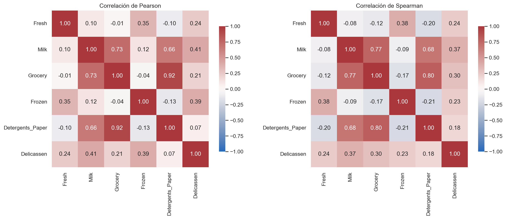
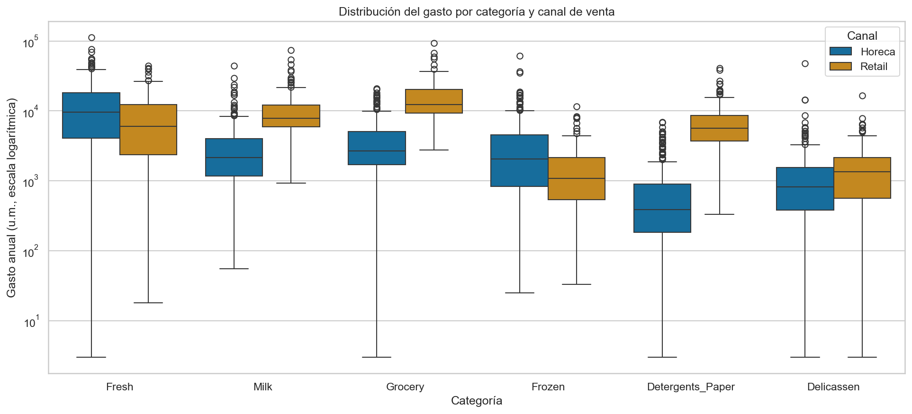
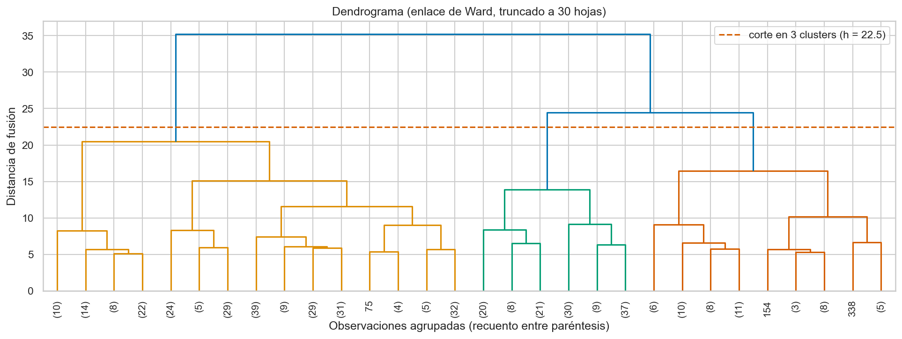
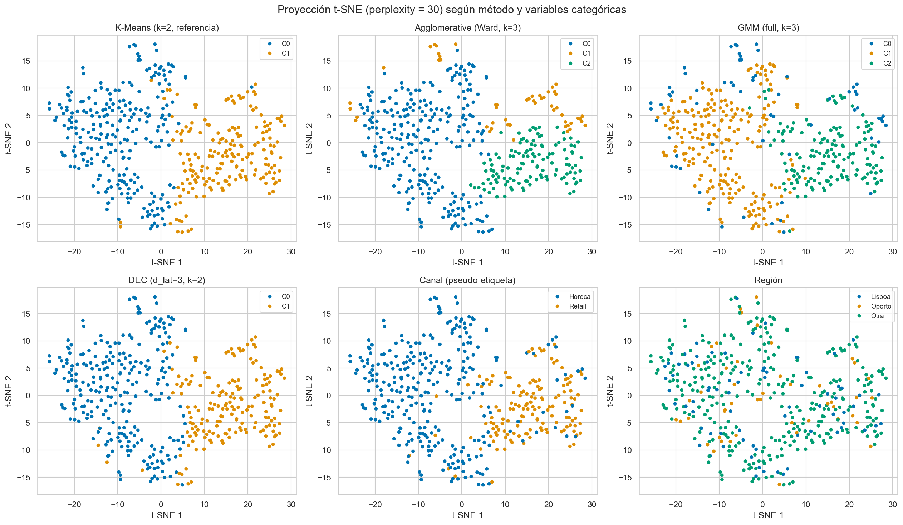
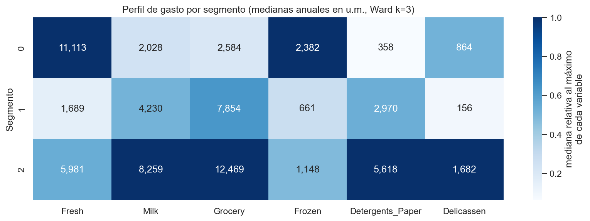

# Segmentación de Clientes Mayoristas con Aprendizaje No Supervisado

**Informe Técnico — Trabajo Práctico Final del Módulo: Aprendizaje No Supervisado**

**Autores:** Federico Moran · Juan Barboza

> Código y materiales: repositorio del proyecto en GitHub. El análisis completo, con todas las salidas y justificaciones intermedias, se encuentra en el notebook [`notebooks/TPF_NoSupervisado_Moran_Barboza.ipynb`](https://github.com/USUARIO/REPO/blob/main/notebooks/TPF_NoSupervisado_Moran_Barboza.ipynb), ejecutable de punta a punta sin pasos previos. <!-- TODO: actualizar USUARIO/REPO -->

---

## 1. Introducción

La segmentación de clientes es un problema central de la analítica de negocios: permite adaptar políticas comerciales, logísticas y de precios a grupos de comportamiento homogéneo. La cartera de un distribuidor mayorista es intrínsecamente heterogénea — coexisten hoteles, restaurantes y cafeterías (canal *Horeca*) con comercios minoristas (canal *Retail*) — y no se dispone de una variable objetivo que indique el segmento de cada cliente. El problema se aborda, en consecuencia, mediante **aprendizaje no supervisado**: descubrir la estructura de grupos latente en los datos de gasto anual y caracterizarla en términos interpretables para el negocio.

## 2. Objetivos

**General:** identificar y caracterizar segmentos de clientes mayoristas a partir de su patrón de gasto anual, aplicando y comparando técnicas de aprendizaje no supervisado.

**Específicos:** (i) realizar un análisis exploratorio que evalúe la calidad de los datos y detecte valores atípicos; (ii) justificar un esquema de preprocesamiento adecuado; (iii) aplicar tres algoritmos de agrupamiento — Agglomerative Clustering, Gaussian Mixture Models y Deep Embedded Clustering — con optimización de hiperparámetros, usando K-Means solo como referencia; (iv) evaluar con métricas internas y externas; (v) visualizar la estructura mediante t-SNE e interpretar críticamente los resultados.

## 3. Dataset

Se utiliza **Wholesale Customers** (Cardoso, 2013), del UCI Machine Learning Repository (DOI: [10.24432/C5030X](https://doi.org/10.24432/C5030X)): **440 observaciones** de clientes de un distribuidor mayorista de Portugal y **8 variables** — el gasto anual en unidades monetarias (u.m.) en seis categorías de producto (`Fresh`, `Milk`, `Grocery`, `Frozen`, `Detergents_Paper`, `Delicassen`) y dos variables categóricas: `Channel` (1 = Horeca, 298 clientes; 2 = Retail, 142) y `Region` (Lisboa, 77; Oporto, 47; otra, 316).

El dataset se descarga automáticamente desde la URL pública de UCI (ZIP → CSV) al ejecutar el notebook, lo que garantiza la reproducibilidad. Las variables `Channel` y `Region` **no se emplean como atributos de agrupamiento**: se reservan como pseudo-etiquetas para la evaluación externa, evitando la circularidad de evaluar los clusters con una variable que participó en su construcción.

## 4. Análisis Exploratorio de Datos

**Calidad.** El dataset está completo: sin valores nulos ni filas duplicadas, y sin valores negativos o cero (mínimos entre 3 y 55 u.m.). No se requirió imputación.

**Forma de las distribuciones.** Las seis variables de gasto presentan asimetría positiva severa (coeficientes entre 2,56 en `Fresh` y 11,15 en `Delicassen`; curtosis de hasta 170,7) y en cuatro de ellas el desvío estándar supera a la media: una minoría de clientes de gran volumen convive con una mayoría de gasto moderado, comportamiento típico de variables monetarias.

**Correlaciones.** Las matrices de Pearson y Spearman coinciden en un bloque fuertemente correlacionado — `Grocery`–`Detergents_Paper` (0,92), `Milk`–`Grocery` (0,73) — interpretable como *canasta de reposición minorista*, y un eje secundario `Fresh`–`Frozen` (0,35) asociable a la hostelería. La coincidencia entre ambas matrices descarta que el patrón sea un artefacto de valores extremos, y la redundancia del bloque sugiere una dimensionalidad efectiva menor que 6.

**Valores atípicos.** Según el criterio IQR, cada variable presenta entre 4,5 % y 9,8 % de valores atípicos, pero el dato decisivo es agregado: **108 filas (24,5 % de la muestra) contienen al menos uno**. Se decidió **conservar todas las observaciones** — son clientes reales de gran volumen, un segmento de alto interés comercial, no errores de medición — y mitigar su influencia mediante transformación logarítmica.

**Perfil por canal.** Los perfiles de gasto difieren marcadamente entre canales: la mediana de Retail en `Grocery` multiplica por 4,6 la de Horeca y en `Detergents_Paper` por 14,6, mientras Horeca domina en `Fresh` y `Frozen`. Esto permitió formular la hipótesis de que la estructura de grupos dominante estaría asociada al canal.

## 5. Preprocesamiento

El pipeline — íntegramente justificado por los hallazgos del EDA — es: **selección de variables** (solo las seis de gasto) → **`log1p`** → **estandarización** (`StandardScaler`).

La transformación logarítmica reduce la asimetría a valores residuales (de 2,56–11,15 a −1,58–−0,22) y las filas con outliers IQR del 24,5 % al 9,5 %, quedando los remanentes en la cola inferior (clientes de actividad casi nula), mucho menos distorsivos. Se comparó `StandardScaler` con `RobustScaler` y `MinMaxScaler`: tras la transformación logarítmica las distribuciones son aproximadamente simétricas, por lo que se adoptó el escalador estándar. No hubo imputación (sin nulos) ni codificación (sin categóricas en el espacio de atributos). Todos los algoritmos se entrenan sobre la misma matriz resultante (440 × 6), de modo que las diferencias observadas sean atribuibles a los métodos.

## 6. Metodología

Se aplicaron cuatro métodos, cada uno con optimización de hiperparámetros justificada:

| Método | Rol | Optimización | Configuración elegida |
|---|---|---|---|
| K-Means | Baseline (referencia) | Codo + silhouette, k ∈ {2..8}, 20 inicializaciones | k = 2 |
| Agglomerative | Requerido | Grilla linkage {ward, complete, average, single} × k ∈ {2..6} + dendrograma | Ward, k = 3 |
| GMM | Requerido | BIC sobre covarianza {full, tied, diag, spherical} × k ∈ {2..8}, 10 reinicios EM | full, k = 3 |
| DEC | Avanzado (deep clustering) | Grilla d_latente ∈ {2,3} × k ∈ {2,3}, solo métricas internas | d_lat = 3, k = 2 |

**Deep Embedded Clustering** (Xie et al., 2016) se implementó en PyTorch: un autoencoder simétrico (6→32→16→d_lat; ~2 000 parámetros, capacidad dimensionada a las 440 observaciones) se pre-entrena minimizando el error de reconstrucción; luego se acopla una capa de agrupamiento con centroides inicializados por K-Means sobre el espacio latente, y se optimizan conjuntamente encoder y centroides minimizando la divergencia KL entre las asignaciones blandas (núcleo t de Student) y una distribución objetivo que las acentúa. El entrenamiento es full-batch, determinista dada la semilla, y converge en segundos en CPU.

Dos decisiones metodológicas merecen mención: en la grilla de Agglomerative se filtraron las particiones con cluster mínimo inferior al 5 % de la muestra (la silhouette máxima, 0,57, correspondía a soluciones degeneradas que aislaban 1–2 clientes extremos); y en la selección de DEC las métricas se calcularon sobre el espacio preprocesado — no el latente, cuyas silhouettes no son comparables entre embeddings — empleando exclusivamente criterios internos.

## 7. Resultados

### 7.1 Comparación de métodos

| Método | Silhouette ↑ | Davies-Bouldin ↓ | Calinski-Harabasz ↑ | ARI (canal) ↑ | NMI (canal) ↑ | Tamaños |
|---|---|---|---|---|---|---|
| K-Means (k=2, ref.) | **0,290** | **1,352** | **189,1** | 0,514 | 0,445 | [252, 188] |
| Agglomerative (Ward, k=3) | 0,255 | 1,539 | 116,8 | **0,549** | 0,409 | [262, 53, 125] |
| GMM (full, k=3) | 0,239 | 2,497 | 92,5 | 0,431 | 0,379 | [66, 224, 150] |
| DEC (d_lat=3, k=2) | 0,285 | 1,369 | 181,8 | 0,546 | **0,457** | [261, 179] |

Los cuatro métodos recuperan sin supervisión una estructura sustancialmente alineada con el canal (ARI 0,43–0,55, muy por encima del 0 esperable por azar). Las particiones binarias dominan las métricas internas, como es esperable a menor k; Ward k=3 obtiene el mejor ARI porque su tercer cluster no rompe la correspondencia con el canal sino que aísla un segmento genuinamente mixto (51 % / 49 %); y las métricas internas del GMM — penalizadas por sus componentes elipsoidales — ilustran que dichas métricas presuponen compacidad esférica y no deben leerse como ranking absoluto.

### 7.2 Visualización

La proyección t-SNE (perplexity = 30, elegida tras explorar {5, 30, 50}) muestra dos regiones dominantes coincidentes con el canal, unidas por una zona de transición sin frontera nítida — coherente con las silhouettes moderadas. El panel de región no exhibe patrón espacial alguno: la estructura es **conductual, no geográfica**.

### 7.3 Perfilado de los segmentos (Ward, k=3)

| Segmento | Clientes | Composición | Gasto total (mediana) | Perfil |
|---|---|---|---|---|
| 0 — Frescos (Horeca) | 262 | 95,8 % Horeca | 22 072 u.m. | `Fresh` 11 113 u.m.; detergentes casi nulos. Hostelería intensiva en perecederos: prioridad de cadena de frío y frecuencia de reparto. |
| 1 — Reposición de bajo volumen (mixto) | 53 | 50,9 % / 49,1 % | 23 523 u.m. | Canasta minorista a pequeña escala; frescos y delicatessen marginales. El grupo que el canal no explica: candidato a desarrollo de cuenta y venta cruzada. |
| 2 — Reposición de gran volumen (Retail) | 125 | 84,0 % Retail | **38 694 u.m.** | Máximos en `Grocery`, `Milk`, `Detergents_Paper` y `Delicassen`. Núcleo de facturación: prioridad de retención. |

Complementariamente, el GMM aporta la lectura probabilística: la mediana de la probabilidad máxima de pertenencia es 0,979 y solo el 8,2 % de los clientes queda por debajo de 0,7 — ese subconjunto de clientes *fronterizos* es en sí mismo un resultado accionable que los métodos de asignación dura no proporcionan.

## 8. Discusión

Los valores moderados de silhouette y la zona de transición del t-SNE indican grupos reales pero no nítidamente separados: una segmentación operativa debería tratar las fronteras como graduales. Sobre el aporte de cada método: Ward produjo la partición más informativa; GMM, la cuantificación de la incertidumbre; DEC alcanzó la mejor NMI y validó el pipeline de deep clustering, aunque su partición es geométricamente casi idéntica a la del baseline — valoración honesta: en un dataset tabular de 6 variables, donde la no linealidad dominante ya fue capturada por la transformación logarítmica, el margen de mejora de una representación latente es reducido, y sus ventajas cabría esperarlas en datos de alta dimensionalidad.

**Limitaciones:** tamaño muestral reducido para métodos profundos (prueba de concepto); `Channel` como pseudo-etiqueta y no verdad de terreno; métricas internas sesgadas hacia geometrías esféricas; influencia de extremos mitigada pero no eliminada; t-SNE usado solo para visualizar, nunca para agrupar.

## 9. Conclusiones

1. El dataset, completo y sin duplicados, exigió una transformación logarítmica que redujo las filas atípicas del 24,5 % al 9,5 % sin descartar clientes — decisión preferible a la eliminación, al tratarse de cuentas reales de gran volumen.
2. Existe estructura de grupos real y verificable, alineada con el canal de venta y de naturaleza conductual, no geográfica.
3. La segmentación más accionable es la de Ward (k=3): *Frescos–Horeca*, *Reposición de bajo volumen–mixto* — hallazgo genuino del enfoque no supervisado — y *Reposición de gran volumen–Retail*.
4. Lección metodológica: ninguna métrica aislada habría conducido a una buena decisión; fue necesaria la combinación de criterios cuantitativos (BIC, silhouette, Davies-Bouldin), inspección estructural (dendrograma, tamaños) y validación externa a posteriori.

**Trabajo futuro:** métodos por densidad (HDBSCAN), variantes de deep clustering con reconstrucción (IDEC, VaDE), agrupamiento por consenso y enriquecimiento del dataset con series temporales e indicadores comerciales.

## 10. Referencias

- Cardoso, M. (2013). *Wholesale customers* [Dataset]. UCI Machine Learning Repository. https://doi.org/10.24432/C5030X
- Pedregosa, F. et al. (2011). Scikit-learn: Machine Learning in Python. *Journal of Machine Learning Research*, 12, 2825–2830.
- van der Maaten, L., & Hinton, G. (2008). Visualizing Data using t-SNE. *Journal of Machine Learning Research*, 9(86), 2579–2605.
- Wong, B. (2011). Points of view: Color blindness. *Nature Methods*, 8(6), 441.
- Xie, J., Girshick, R., & Farhadi, A. (2016). Unsupervised Deep Embedding for Clustering Analysis. *Proceedings of the 33rd International Conference on Machine Learning* (ICML).
